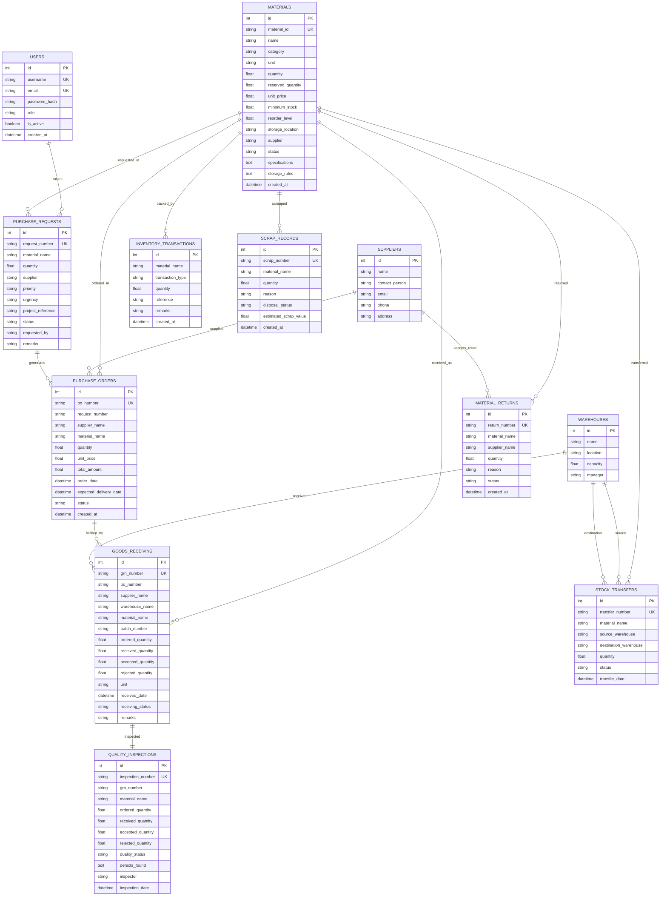

# Entity-Relationship (ER) Diagram
## Project 28: AI-Enabled Material Management System

The following Entity Relationship Diagram represents the logical database design of the AI-Enabled Material Management System.

---

# Entity Description

### USERS
Stores user login credentials, roles, authentication details, and access permissions.

### MATERIALS
Master inventory table containing all materials with stock levels, pricing, storage rules, and reorder information.

### SUPPLIERS
Stores supplier contact information and vendor details used during procurement.

### WAREHOUSES
Represents warehouse locations used for inventory storage and stock transfers.

### PURCHASE REQUESTS
Department requests for purchasing new materials including urgency, priority, and project references.

### PURCHASE ORDERS
Official purchase orders generated from approved purchase requests.

### GOODS RECEIVING (GRN)
Captures all incoming deliveries from suppliers including received quantities and batch details.

### QUALITY INSPECTIONS
Stores inspection results for every Goods Receipt Note (GRN) including accepted and rejected quantities.

### INVENTORY TRANSACTIONS
Maintains the complete stock movement history including issue, receipt, return, adjustment, and consumption.

### STOCK TRANSFERS
Tracks movement of materials between warehouses.

### SCRAP RECORDS
Stores damaged, expired, or unusable material details along with estimated scrap value.

### MATERIAL RETURNS
Tracks material returns sent back to suppliers due to defects or excess procurement.

---

# AI Modules (Logical Layer)

The AI Engine operates on the following entities:

- Materials
- Suppliers
- Purchase Requests
- Purchase Orders
- Goods Receiving
- Inventory Transactions
- Scrap Records

The AI layer provides:

- Material Demand Forecasting
- Supplier Recommendation
- Lead Time Prediction
- Substitute Material Recommendation
- Wastage Risk Detection
- Natural Language Inventory Chatbot